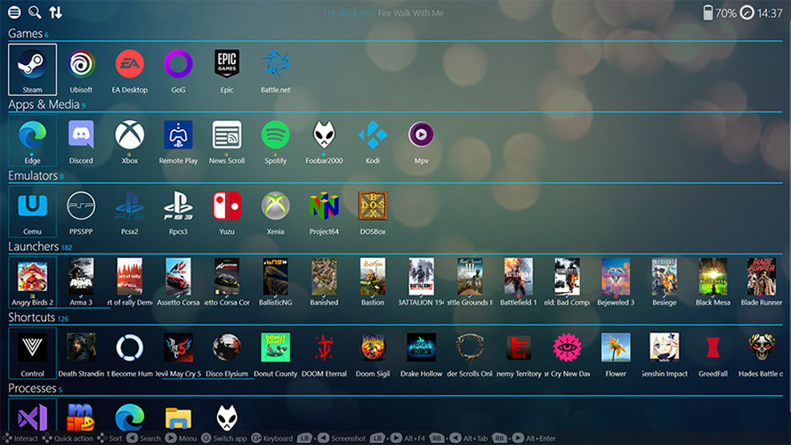
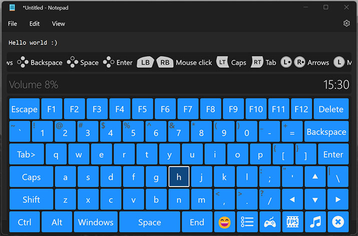
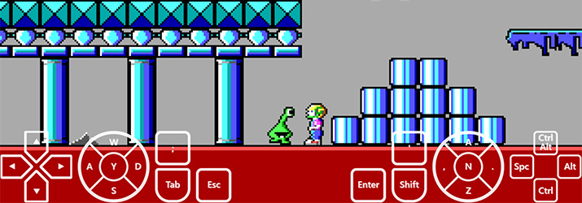
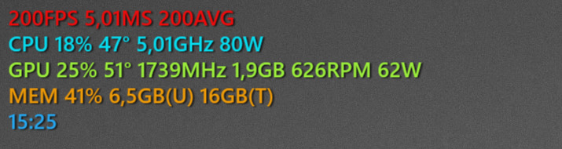
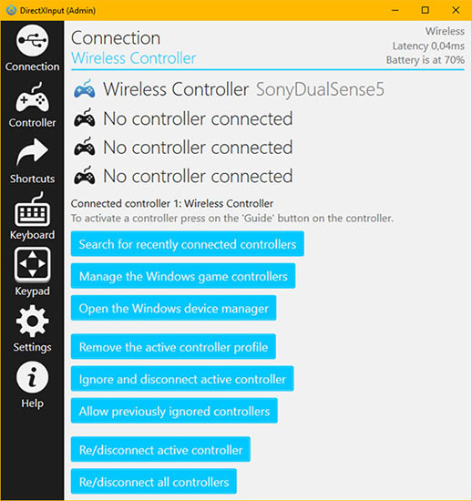

## Application Description
CtrlUI (Controller User Interface) is a Windows application, game and emulator launcher for your game controller,
this application allow you to run all your favorite applications from one location with lots of useful features.

DirectXInput converts your game controller like a DualShock 1, 2, 3, 4 and DualSense 5 to a Xbox (XInput) controller,
so that it can be used with almost every game and application released that has support for Xbox controllers.

Fps Overlayer is a tool that shows the frames per second and the cpu, gpu and memory information.

## CtrlUI Application Features
- Add Windows UWP applications so you can easily launch them.
- Launch emulators with a rom selected from a rom directory.
- Switch to other running processes with your controller.

## DirectXInput Application Features
- Easily customize the controller button layout.
- Make and save a screenshot directly from your controller.
- Control your system volume and media with your controller.
- Built-in on screen keyboard which can be used by your controller.
- Supported controllers: PlayStation 1, 2, 3, 4, 5 and more.
- Unsupported controllers: Xbox and XInput controllers.

## Fps Overlayer Application Features
- Show the current frame rate of a running application.
- Show the current time on your screen while gaming.

## Installation Instructions
1) Extract the CtrlUI folder to any directory you want on your device.
2) Make sure that you have installed all the requirements listed below.
3) Launch CtrlUI executable and setup a few basic apps in the welcome screen.
4) Enjoy using your new controller friendly based user interface.

## Uninstallation Instructions
1) Run the Driver Installer and click on "Uninstall drivers" and "Cleanup"
2) Remove the extracted CtrlUI directory.

## Tips and tricks
- Let CtrlUI automatically launch on Windows startup for easier alltime usage.
- Some users may need to run the application as administrator to let it work properly.*
- For more information and help open the "Help" window or tab in the application.
* You can run it as administrator by using the "CtrlUI-Launcher" executable.

## Known issues
- Overlays may not always show up when you are in a fullscreen application.
- Alt+Enter controller shortcut may not work for all Windows Store applications.
- Keyboard cannot be used in the web browser overlay due to window issues.

## Requirements
- Microsoft Visual C++ Redistributable installed.
- Windows operating system 10 64-bit or higher is required.
- Supported game controller connected through DirectXInput.

## Special thanks
- Benjamin Höglinger-Stelzer (Nefarius)
- Travis Nickles (Ryochan7)
- How Long To Beat (HLTB)
- Internet Game Database (IGDB)
- LibreHardwareMonitor community.
- SteamKit community.

## Support and bug reporting
When you are walking into any problems or a bug you can go to my help page at https://help.arnoldvink.com so I can try to help you out and get everything working.

## Developer donation
If you appreciate my project and want to support me you can make a donation through https://donation.arnoldvink.com

## Changelog
v1.99.2.0 (29-September-2023)
- FpsOverlayer: Added setting to show GPU memory speed and hotspot temperature.
* Miscellaneous application improvements and fixes.

v1.99.0.0 (6-September-2023)
- CtrlUI: Added Auto HDR launch option to enable and allow unsupported applications.

v1.98.0.0 (17-August-2023)
- CtrlUI: Improved navigation by allowing horizontal looping in lists.
- DirectXInput: Added DualSense rumble power mode setting.

v1.96.0.0 (12-May-2023)
- DirectXInput: Holding the touchpad now starts video screen capture.

v1.95.0.0 (22-March-2023)
- CtrlUI: Added 'Hide/minimize application' function.
- CtrlUI: Added setting to increase or decrease application image size.
- Keyboard: Added shortcuts like Save, Search, Toggle Desktop and show Task Manager.
- DirectXInput: Added tool mode to the keyboard to control other applications.
- DirectXInput: Alt+Tab shortcut now holds the alt key while you hold the start button.
- FpsOverlayer: Added Open Cross, Square and Circle crosshair styles.
- FpsOverlayer: Added setting to show the current date.
- FpsOverlayer: Added setting to change the average fps time span.
- FpsOverlayer: Added setting to flip stats order when positioned on bottom.
- Added Screen Capture Tool to take screenshots.

v1.90.0.0 (21-February-2023)
- FpsOverlayer: Added frametime graph.

v1.84.0.0 (13-January-2023)
- FpsOverlayer: Added web browser overlay.

v1.80.0.0 (30-September-2022)
- CtrlUI: Interface redesigned to overlay window.
- CtrlUI: Added How Long To Beat gametime support.
- DirectXInput: Added media duration and progress.

v1.65.0.0 (12-May-2022)
- Added new screencapturer with HDR support.

v1.57.0.0 (9-June-2021)
- DirectXInput: You can now also move the mouse with the keypad.

v1.53.0.0 (15-April-2021)
- DirectXInput: Changed HidGuardian to HidHide.
- DirectXInput: Added Debug and Controller Ignore tab.

v1.50.5.0 (15-January-2021)
- You can now separately set left and right trigger rumble strength.

v1.50.4.0 (13-January-2021)
- Added controller custom led color support.

v1.50.0.0 (25-December-2020)
- Added controller motion gyroscope DSU client support.

v1.34.0.0 (12-December-2020)
- Switched virtual Xbox controller driver to ViGEmBus.

v1.33.0.0 (12-November-2020)
- Added Sony PlayStation 5 DualSense controller support.

v1.31.0.0 (16-October-2020)
- Added emoji's menu to the on screen keyboard.

v1.30.0.0 (28-August-2020)
- CtrlUI now loads games from other installed game launchers.

v1.18.0.0 (5-May-2020)
- DirectXInput now shows overlay notifications.

v1.17.0.0 (17-April-2020)
- You can now download rom information from the file picker.

v1.15.0.0 (1-April-2020)
- You can now disable a button on the controller mapping screen.
- Added support for PlayStation 3 Move Navigation Controller.

v1.12.1.0 (24-March-2020)
- Fps Overlayer can now show the current time.

v1.12.0.0 (29-January-2020)
- Added application profile manager.
- Added live background video support.

v1.9.5.0 (29-October-2019)
- Added Windows Store shortcuts loading support.
- You can now set the fps overlayer position for each app.

v1.9.1.0 (7-October-2019)
- Replaced Quick Launch with Quick Actions.
- Added modified date sorting to the file picker.

v1.9.0.0 (3-October-2019)
- You can now select a media file when launching a media app.

v1.8.8.0 (10-September-2019)
- Added display monitor switching function.
- Added keyboard layout selection to keyboard controller.
- Improved support for Win32 Windows store applications.

v1.8.0.0 (15-August-2019)
- CtrlUI is now controller through DirectXInput so it can block controller input to games.

v1.7.0.0 (9-August-2019)
- Added mouse movement support to the keyboard controller.

v1.6.0.0 (7-August-2019)
- Windows store applications now display the fps properly.

v1.5.1.0 (23-July-2019)
- Added audio playback device switch function.
- Added font size slider setting to allow bigger texts.
- Optimized the main menu for controllers and bigger displays.

v1.3.5.0 (5-June-2019)
- Added Fps Overlayer a tool that shows the frames per second.
- Improved the Microsoft Windows Store application support.

v1.2.0.25 (27-February-2019)
- Added on screen keyboard controller.
- Added Desktop shortcuts launching support.

v1.0.0.16 (14-February-2019)
- Parsec gaming now also gets disconnected when closing streams.

v1.0.0.12 (21-March-2018)
- Added controller buttons help on the bottom screen.

v1.0.0.8 (29-June-2017)
- Added administrator launchers to prevent admin prompt.

v1.0.0.6 (30-May-2017)
- Added work in progress user interface sounds.

v1.0.0.5 (24-May-2017)
- You can now press Alt+Tab with your controller.
- You can now press Alt+F4 with your controller.
- You can now press Alt+Enter with your controller.

v1.0.0.3 (21-May-2017)
- You can now restart an application from the todo list.

v1.0.0.2 (20-May-2017)
- You can now set another controller as the active controller.

v1.0.0.0 (14-April-2017)
- First official test release.